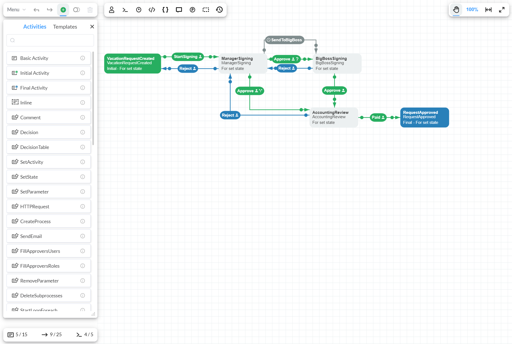

# WorkflowEngine Designer for React Sample

## Introduction

WorkflowEngine Designer for React is a library developed to facilitate the use of this component. It provides a convenient way to interact and create the Workflow Designer on your web page using React. This section explains you how to add the Workflow Designer to your web application in a convenient format  - Get Started -  that thoroughly interprets the procedure, step by step.

## Prerequisites

To run the example below, you should create the WorkflowEngine backend capable of handling requests from the Workflow Designer, the NodeJS runtime, and  the NPM package manager to download the required packages. That is all you need for further action.

## Get Started

The first step is to create a working directory where the project will be developed. For this, you can use the `create-react-app` console command and install the `@optimajet/workflow-designer-react` npm-package:

```shell
npx create-react-app workflow-designer-react-sample
cd workflow-designer-react-sample
npm install @optimajet/workflow-designer-react
```

Now, the `workflow-designer-react-sample` folder contains all the necessary files for our web application. Their file hierarchy is presented below (depending on the version used, it may differ):

```
├── node_modules
│   └── ...
├── public
│   ├── favicon.ico
│   ├── index.html
│   ├── logo192.png
│   ├── logo512.png
│   ├── manifest.json
│   └── robots.txt
├── src
│   ├── App.css
│   ├── App.js
│   ├── App.test.js
│   ├── index.css
│   ├── index.js
│   ├── logo.svg
│   ├── reportWebVitals.js
│   └── setupTests.js
├── package.json
├── README.md
└── yarn.lock
```

You can start this application by writing `npm start` in the command line from the working directory.

Next, we delete some unnecessary files. If you do not want, you can leave everything as it is; these files do not affect the execution of the application.

In the project root, delete the `README.md` file. Then, go to the `public` folder and delete the following files:

- logo192.png
- logo512.png
- manifest.json
- robots.txt

Now, go to the `src` folder and delete these files:

- logo.svg
- reportWebVitals.js
- setupTests.js

Having deleted these files, you must remove each reference to them from other files. For this, go to the contents of the `src/App.css` file and completely delete the contents. Next, delete the following snippets in the `src/App.js` file

```javascript
1. import logo from './logo.svg';
2. 	<header className="App-header">
		
        <p>
          Edit <code>src/App.js</code> and save to reload.
        </p>
        <a
          className="App-link"
          href="https://reactjs.org"
          target="_blank"
          rel="noopener noreferrer"
        >
          Learn React
        </a>
	</header>
```

Next, delete the following lines in the `src/index.js` file:

```javascript
1. import reportWebVitals from './reportWebVitals';
2. reportWebVitals();
```

After completing these steps, a blank page will be displayed at startup (`npm start`).

Now, let's go directly to connecting and displaying the Workflow Designer in this web application. For this, open the `src/App.js` file and paste the following code:

```javascript
import React from 'react'
import './App.css';
import WorkflowDesigner from '@optimajet/workflow-designer-react';

function App() {
  // ---------- Parameters for Workflow Designer ---------------
  const schemeCode = '<YOUR_SCHEME_CODE_VALUE>';
  const processId = undefined;
  const designerConfig = {
    renderTo: 'wfdesigner',
    apiurl: '<YOUR_API_URL_VALUE>',
    templatefolder: '/templates/',
    widthDiff: 0,
    heightDiff: 0
  };

  return (
    <WorkflowDesigner
      schemeCode={schemeCode}
      processId={processId}
      designerConfig={designerConfig}
    />
  );
}

export default App;
```

In this section:

- `schemeCode` - is the code for the Workflow diagram to be displayed in the Workflow Designer.
- `processId` - is the identifier of the WorkflowEngine process.
- `designerConfig` - are the direct settings for the Designer indicating all the necessary parameters, namely: the HTTP address of the WorkflowAPI for interacting with the server side of the application (`apiurl`), the difference between the total page width and the width available for the WorkflowDesigner (`widthDiff`), and the difference between the total page height and the height available for the WorkflowDesigner (`heightDiff`) to display the WorkflowDesigner window. For a more detailed list of the parameters, see the **Designer** section of the documentation page about the WorkflowEngine.

> **NOTE:** Be careful with the case of the characters when specifying the parameters. For example: `apiUrl` and `apiurl` are two completely different values.

If you want to display the Workflow scheme in the Workflow Designer interface, set the required value to the `schemecode` variable, and assign the `undefined` value to the `processId`. In case you want to display the Workflow process, assign the `undefined` value to the `schemecode`, and the required value to the `processId` variable of the WorkflowEngine process identifier.

Now, run the `npm start` command and your page will display something like that:


## How to Call WorkflowDesigner Functions inside React Component

The `workflow-designer-react` component is a wrapper over the usual WorkflowDesigner. Some of the most commonly used methods are wrapped in the `workflow-designer-react` component for convenience. To use them, do the following:

1. In the constructor of your component, create a class variable (for example, `this.workflowDesigner`) and assign the `React.createRef()` value to it; in the `render()` method of your component, in the `WorkflowDesigner` component, assign the value of the created variable to the `ref` parameter:

   ```javascript
   import WorkflowDesigner from '@optimajet/workflow-designer-react';
   import React from 'react';
   
   export default class YourComponent extends React.Component {
       constructor(props) {
           super(props);
           this.workflowDesigner = React.createRef();
       }
       
       render() {
           // ---------- Parameters for Workflow Designer ---------------
           const schemeCode = '<YOUR_SCHEME_CODE_VALUE>';
           const processId = undefined;
           const designerConfig = {
               renderTo: 'wfdesigner',
               apiurl: '<YOUR_API_URL_VALUE>',
               templatefolder: '<TEMPLATE_FOLDER_PATH>',
               widthDiff: 0,
               heightDiff: 0
           };
           
           return (
              <WorkflowDesigner
                schemeCode={schemeCode}
                processId={processId}
                designerConfig={designerConfig}
                ref={this.workflowDesigner}
              />
           );
       }
   }
   ```

2. Now you can use the methods of the `WorkflowDesigner` component directly in your component:

   ```javascript
   yourFunction() {
       this.workflowDesigner.current.methodName();
   }
   ```

A complete list of the methods available for use from the `WorkflowDesigner` component is given below:

| Method Name                          | Description                                                  |
| ------------------------------------ | ------------------------------------------------------------ |
| clearScheme()                        | Clears the designer, equivalent of creating empty scheme design |
| getDesignerErrors()                  | Get Workflow Designer Errors<br/>**Returns** Errors in Workflow Designer |
| save(successCallback, errorCallback) | Save Workflow scheme<br/>**successCallback** Function which will be executed if save was successful<br/>**errorCallback** Function which will be executed if save operation failed |
| downloadScheme()                     | Download XML file with Workflow Scheme description |
| downloadBpmn()                       | Download BPMN file with BPM description of the scheme. |
| upload(uploadType, callback)         | Upload BPMN or XML file.<br>**uploadType** Upload type, can be 'scheme' or 'bpmn'<br/>**callback** Function that will be executed after uploading file |
| isSchemeExist()                      | Check for scheme existence by the scheme code from props. <br>**Returns** {boolean} If scheme exists true, otherwise, false |
| isProcessExist()                     | Check for process existence by scheme code and process id given in props. <br>**Returns** {boolean} If process exists true, otherwise, false |
| refresh()                            | Refresh data in WorkflowDesigner                             |

In case you want some methods that are not presented in this table, use the WorkflowDesigner and call its methods directly without wrappers, for example:

```javascript
this.workflowDesigner.current.innerDesigner.methodName();
```
